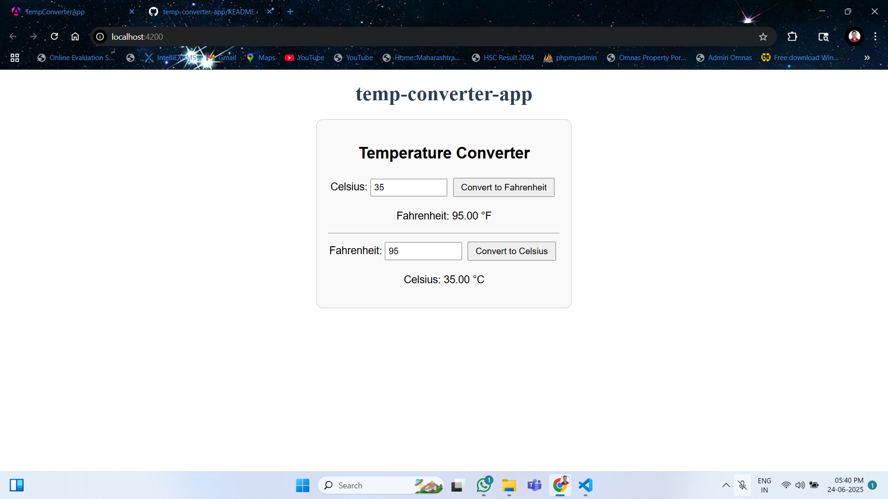

🌡️ Temp Converter App
A simple and interactive web application that converts temperatures between Celsius and Fahrenheit using Angular. Ideal for learning about Angular components, event handling, two-way binding, and data interpolation.

📸 Preview

🛠️ Features
🔁 Convert between Celsius and Fahrenheit in real time

📲 Two-way data binding for seamless user interaction

✅ Form validation to ensure correct numeric input

🎯 Modular architecture with standalone Angular components

🚀 Technologies Used
Angular (v17 or later)

TypeScript

HTML & CSS

Node.js (for running the development server)

📂 Project Structure
plaintext
Copy
Edit
temp-converter-app/
│
├── src/
│   ├── app/
│   │   ├── temp-converter/
│   │   │   ├── temp-converter.ts
│   │   │   ├── temp-converter.html
│   │   │   └── temp-converter.css
│   │   └── app.component.ts
│   └── index.html
├── angular.json
├── package.json
└── README.md
🧑‍💻 Getting Started
Prerequisites
Node.js & npm installed

Angular CLI installed (npm install -g @angular/cli)

Installation
Clone the repository:

bash
Copy
Edit
git clone https://github.com/your-username/temp-converter-app.git
Navigate to the project directory:

bash
Copy
Edit
cd temp-converter-app
Install dependencies:

bash
Copy
Edit
npm install
Running Locally
bash
Copy
Edit
ng serve
Open your browser at http://localhost:4200

✏️ How It Works
User inputs a temperature in either Celsius or Fahrenheit.

The app uses a conversion formula to update the other field.

Two-way binding ([(ngModel)]) keeps the inputs in sync.

